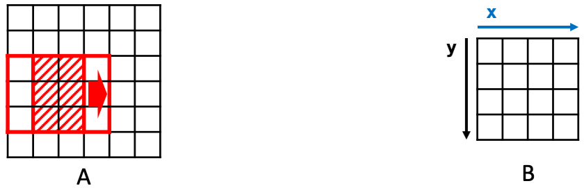
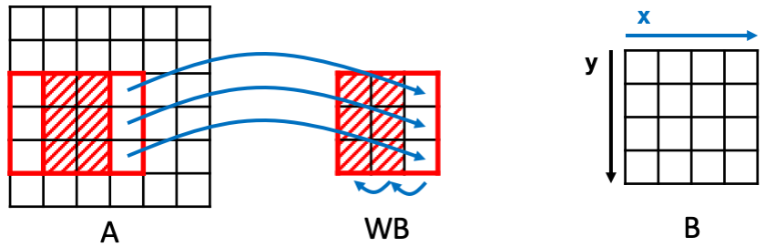

.. note::
    :class: sphx-glr-download-link-note

    Click :ref:`here <sphx_glr_download_tutorials_tutorial_06_memory.py>` to download the full example code
.. rst-class:: sphx-glr-example-title

.. _sphx_glr_tutorials_tutorial_06_memory.py:

Memory Customization
====================

**Author**: Yi-Hsiang Lai (seanlatias@github)

In this tutorial, we demonstrate how memory customization works in HeteroCL.

.. code-block:: default

    import heterocl as hcl
    import numpy as np

Memory Customization in HeteroCL
--------------------------------
There are two types of memory customization in HeteroCL. The first one is
similar to what we have seen in
:ref:`sphx_glr_tutorials_tutorial_04_compute.py`, where we demonstrate some
primitives that will be synthesized as pragmas. An example of such primitive
is ``partition``. Following is an example. Note that the primitive is
directly applied on the schedule instead of a stage. This is because we are
modifying the property of a tensor.

.. code-block:: default

    hcl.init()

    A = hcl.placeholder((10, 10), "A")

    def kernel(A):
        return hcl.compute(A.shape, lambda x, y: A[x][y]+1, "B")

    s = hcl.create_schedule(A, kernel)
    s.partition(A)
    print(hcl.lower(s))

.. rst-class:: sphx-glr-script-out

 Out:

 .. code-block:: none

    array partition variable=A complete factor=0 dim=0
    produce B {
      // attr [0] extern_scope = 0
      for (x, 0, 10) {
        for (y, 0, 10) {
          B[(y + (x*10))] = (A[(y + (x*10))] + 1)
        }
      }
    }

In the IR, we should see a line that annotates tensor ``A`` to be
partitioned completely.

.. note::

   For more information, please see
   :obj:`heterocl.schedule.Schedule.partition`

Another example is to reshape a tensor. This is helpful when we combine
partitioning with loop titling. In this example, we split the inner axis
``y`` and also reshape the output tensor ``B``. After that, we pipeline
the middle axis ``yo`` and partition the output tensor accordingly. **Note
that the** ``reshape`` **primitive cannot be applied to the input tensors.**

.. code-block:: default

    hcl.init()

    s = hcl.create_schedule(A, kernel)
    yo, yi = s[kernel.B].split(kernel.B.axis[1], 5)
    s[kernel.B].pipeline(yo)
    s.reshape(kernel.B, (10, 2, 5))
    s.partition(kernel.B, dim=3)
    print(hcl.build(s, target="vhls"))

.. rst-class:: sphx-glr-script-out

 Out:

 .. code-block:: none

    #include <ap_int.h>
    #include <ap_fixed.h>
    #include <math.h>

    void default_function(ap_int<32> A[10][10], ap_int<32> B[10][2][5]) {
    #pragma HLS array_partition variable=B complete dim=3
      for (ap_int<32> x = 0; x < 10; ++x) {
        for (ap_int<32> y_outer = 0; y_outer < 2; ++y_outer) {
        #pragma HLS pipeline
          for (ap_int<32> y_inner = 0; y_inner < 5; ++y_inner) {
            B[x][y_outer][y_inner] = (A[x][(y_inner + (y_outer * 5))] + 1);
          }
        }
      }
    }

Data Reuse in HeteroCL
----------------------
The other type of memory customization primitives involves the introduction
of allocation of new memory buffers. An example is data reuse. The idea of
data reuse is to reduce the number of accesses to a tensor by introducing
an intermediate buffer that holds the values being reused across different
iterations. This finally leads to better performance in hardware.

Example: 2D Convolution
-----------------------
To demonstrate this, we use the computation of 2D convolution as an example.
Let's see how we can define 2D convolution in HeteroCL.

.. code-block:: default

    hcl.init()

    A = hcl.placeholder((6, 6), "A")
    F = hcl.placeholder((3, 3), "F")

    def kernel(A, F):
        r = hcl.reduce_axis(0, 3)
        c = hcl.reduce_axis(0, 3)
        return hcl.compute((4, 4),
                lambda y, x: hcl.sum(A[y+r, x+c]*F[r, c], axis=[r, c]), "B")

    s = hcl.create_schedule([A, F], kernel)
    print(hcl.lower(s))

.. rst-class:: sphx-glr-script-out

 Out:

 .. code-block:: none

    produce B {
      // attr [0] extern_scope = 0
      for (y, 0, 4) {
        for (x, 0, 4) {
          // attr [sum] storage_scope = "global"
          allocate sum[int32 * 1]
          produce sum {
            // attr [0] extern_scope = 0
            sum[0] = 0
          }
          for (ra0, 0, 3) {
            for (ra1, 0, 3) {
              sum[0] = int32((int65((int64(A[((x + ra1) + ((y + ra0)*6))])*int64(F[(ra1 + (ra0*3))]))) + int65(sum[0])))
            }
          }
          B[(x + (y*4))] = sum[0]
        }
      }
    }

In the above example, we convolve the input tensor ``A`` with a filter ``F``.
Then, we store the output in tensor ``B``. Note that the output shape is
different from the shape of the input tensor. Let's give some real inputs.

.. code-block:: default

    hcl_A = hcl.asarray(np.random.randint(0, 10, A.shape))
    hcl_F = hcl.asarray(np.random.randint(0, 10, F.shape))
    hcl_B = hcl.asarray(np.zeros((4, 4)))
    f = hcl.build(s)
    f(hcl_A, hcl_F, hcl_B)
    print('Input:')
    print(hcl_A)
    print('Filter:')
    print(hcl_F)
    print('Output:')
    print(hcl_B)

.. rst-class:: sphx-glr-script-out

 Out:

 .. code-block:: none

    Input:
    [[2 3 2 3 0 8]
     [5 4 9 4 6 5]
     [6 2 5 6 1 6]
     [5 4 8 1 8 5]
     [3 9 7 3 8 3]
     [9 7 4 6 6 6]]
    Filter:
    [[7 7 2]
     [8 1 0]
     [9 3 5]]
    Output:
    [[168 145 179 162]
     [228 185 264 187]
     [199 218 256 143]
     [234 270 222 207]]

To analyze the data reuse, let's take a closer look to the generated IR.
To begin with, we can see that in two consecutive iterations of ``x`` (i.e.,
the inner loop), there are 6 pixels that are overlapped, as illustrated in
the figure below. Without any optimization, **we are reading 9 values from
the input for each iteration**.

Introduce Data Reuse: Window Buffer
~~~~~~~~~~~~~~~~~~~~~~~~~~~~~~~~~~~
To reuse the overlapped pixels, we can introduce a reuse buffer. Since the
filter moves like a window, we call the buffer a window buffer ``WB``. The
window buffers stores the reused pixels and also the new pixels that will
be used in the current iteration. For each iteration, to update the values
inside the window buffer, the last two columns, in this case, shift left.
After that, the last column is replaced with the pixels read from the
input. Now, we only **read 3 values from the input for each iteration**.

To introduce such reuse buffers in HeteroCL, we use the API ``reuse_at``.
The first argument is the **tensor** whose values will be reused. The
second argument is the output **stage** that reuses the values of the
tensor. The reason why we need to specify this is because we may have
multiple stages reusing the values from the same input tensor. The third
argument is the desired axis to be reused. It must be the output axis.
Finally, we can specify the name of the reuse buffer. The API returns
a new tensor.

.. code-block:: default

    s_x = hcl.create_schedule([A, F], kernel)
    WB = s_x.reuse_at(A, s_x[kernel.B], kernel.B.axis[1], "WB")
    print(hcl.lower(s_x))

.. rst-class:: sphx-glr-script-out

 Out:

 .. code-block:: none

    produce B {
      // attr [WB] storage_scope = "global"
      allocate WB[int32 * 3 * 3]
      // attr [0] extern_scope = 0
      for (y, 0, 4) {
        for (x.reuse, 0, 6) {
          produce WB {
            for (A.1, 0, 3) {
              for (A.0, 0, 2) {
                WB[(A.0 + (A.1*3))] = WB[((A.0 + (A.1*3)) + 1)]
              }
              WB[((A.1*3) + 2)] = A[(x.reuse + ((y + A.1)*6))]
            }
          }
          if ((2 <= x.reuse)) {
            // attr [sum] storage_scope = "global"
            allocate sum[int32 * 1]
            produce sum {
              // attr [0] extern_scope = 0
              sum[0] = 0
            }
            for (ra2, 0, 3) {
              for (ra3, 0, 3) {
                sum[0] = int32((int65((int64(WB[(ra3 + (ra2*3))])*int64(F[(ra3 + (ra2*3))]))) + int65(sum[0])))
              }
            }
            B[((x.reuse + (y*4)) + -2)] = sum[0]
          }
        }
      }
    }

In the printed IR, you should be able to see a buffer ``WB`` with size
(3, 3) being allocated. Moreover, in the ``produce WB`` scope, you should
see the update algorithm described above. Now let's test the function again.

.. code-block:: default

    hcl_Bx = hcl.asarray(np.zeros((4, 4)))
    f = hcl.build(s_x)
    f(hcl_A, hcl_F, hcl_Bx)
    print('Output without WB:')
    print(hcl_B)
    print('Output with WB:')
    print(hcl_Bx)

.. rst-class:: sphx-glr-script-out

 Out:

 .. code-block:: none

    Output without WB:
    [[168 145 179 162]
     [228 185 264 187]
     [199 218 256 143]
     [234 270 222 207]]
    Output with WB:
    [[168 145 179 162]
     [228 185 264 187]
     [199 218 256 143]
     [234 270 222 207]]

You should see the same results with and without the window buffer.

Reuse at a Different Dimension: Linebuffer
~~~~~~~~~~~~~~~~~~~~~~~~~~~~~~~~~~~~~~~~~~
Similarly, we can create a reuse buffer for two consecutive iterations of
``y``. In this case, in each iteration of ``y``, we read an entire row from
input ``A``. Meanwhile, we update the reuse buffer by shifting up. Since it
reads an entire line at a time, we call it a linebuffer ``LB``. The
operation is illustrated in the figure below.

Similar to the window buffer, we can introduce the linebuffer in HeteroCL by
using a single ``reuse_at`` API. We show the code below.

.. code-block:: default

    s_y = hcl.create_schedule([A, F], kernel)
    LB = s_y.reuse_at(A, s_y[kernel.B], kernel.B.axis[0], "LB")
    print(hcl.lower(s_y))

    hcl_By = hcl.asarray(np.zeros((4, 4)))
    f = hcl.build(s_y)
    f(hcl_A, hcl_F, hcl_By)
    print('Output without LB:')
    print(hcl_B)
    print('Output with LB:')
    print(hcl_By)

.. rst-class:: sphx-glr-script-out

 Out:

 .. code-block:: none

    produce B {
      // attr [LB] storage_scope = "global"
      allocate LB[int32 * 3 * 6]
      // attr [0] extern_scope = 0
      for (y.reuse, 0, 6) {
        produce LB {
          for (A.0, 0, 6) {
            for (A.1, 0, 2) {
              LB[(A.0 + (A.1*6))] = LB[((A.0 + (A.1*6)) + 6)]
            }
            LB[(A.0 + 12)] = A[(A.0 + (y.reuse*6))]
          }
        }
        for (x, 0, 4) {
          if ((2 <= y.reuse)) {
            // attr [sum] storage_scope = "global"
            allocate sum[int32 * 1]
            produce sum {
              // attr [0] extern_scope = 0
              sum[0] = 0
            }
            for (ra4, 0, 3) {
              for (ra5, 0, 3) {
                sum[0] = int32((int65((int64(LB[((x + ra5) + (ra4*6))])*int64(F[(ra5 + (ra4*3))]))) + int65(sum[0])))
              }
            }
            B[((x + (y.reuse*4)) + -8)] = sum[0]
          }
        }
      }
    }

    Output without LB:
    [[168 145 179 162]
     [228 185 264 187]
     [199 218 256 143]
     [234 270 222 207]]
    Output with LB:
    [[168 145 179 162]
     [228 185 264 187]
     [199 218 256 143]
     [234 270 222 207]]

Note that the difference between WB and LB is the we reuse at different
axes. We can also see from the printed IR that the allocated size is larger,
which is the same as illustrated in the figure above. In this case, we read
6 pixels from the input for each iteration of ``y``, which means we read 1
pixel for each iteration of ``x`` **effectively**. Namely, this is not true
in terms of hardware execution. Can we do even better?

Combine Window Buffer and Linebuffer
~~~~~~~~~~~~~~~~~~~~~~~~~~~~~~~~~~~~
We do not need to restrict ourselves to reuse at a single dimension. Since
we have data reuse in both dimension, we can reuse both. In this case,
we generate both a linebuffer and a window buffer. Let's take a look at
the figure first.

.. figure:: ../../../tutorials/moving_x/Slide4.png
   :scale: 60 %

What happens here is that, we first update the linebuffer (blue arrows),
then we update the window buffer (purple arrows). More precisely, for each
iteration of ``x``, we **read 1 pixel from input ``A``**. We simultaneously
shift up the linebffer. After we update the linebuffer, we go on update the
window buffer by reading pixels updated in the linebuffer. Then we shift the
window buffer. To describe such behavior in HeteroCL is very easy. We only
need to apply ``reuse_at`` twice. We just need to specify the corresponding
reuse tensors and the reuse axes. In this case, the linebuffer reuses the
pixels from the input ``A`` while the window buffer reuses from the
linebuffer. Following we show the code and its IR.

.. code-block:: default

    s_xy = hcl.create_schedule([A, F], kernel)
    LB = s_xy.reuse_at(A, s_xy[kernel.B], kernel.B.axis[0], "LB")
    WB = s_xy.reuse_at(LB, s_xy[kernel.B], kernel.B.axis[1], "WB")
    print(hcl.lower(s_xy))

    hcl_Bxy = hcl.asarray(np.zeros((4, 4)))
    f = hcl.build(s_xy)
    f(hcl_A, hcl_F, hcl_Bxy)
    print('Output without reuse buffers:')
    print(hcl_B)
    print('Output with reuse buffers:')
    print(hcl_Bxy)

.. rst-class:: sphx-glr-script-out

 Out:

 .. code-block:: none

    produce B {
      // attr [LB] storage_scope = "global"
      allocate LB[int32 * 3 * 6]
      // attr [WB] storage_scope = "global"
      allocate WB[int32 * 3 * 3]
      // attr [0] extern_scope = 0
      for (y.reuse, 0, 6) {
        for (x.reuse, 0, 6) {
          produce LB {
            for (A.1, 0, 2) {
              LB[(x.reuse + (A.1*6))] = LB[((x.reuse + (A.1*6)) + 6)]
            }
            LB[(x.reuse + 12)] = A[(x.reuse + (y.reuse*6))]
          }
          if ((2 <= y.reuse)) {
            produce WB {
              for (LB.1, 0, 3) {
                for (LB.0, 0, 2) {
                  WB[(LB.0 + (LB.1*3))] = WB[((LB.0 + (LB.1*3)) + 1)]
                }
                WB[((LB.1*3) + 2)] = LB[(x.reuse + (LB.1*6))]
              }
            }
            if ((2 <= x.reuse)) {
              // attr [sum] storage_scope = "global"
              allocate sum[int32 * 1]
              produce sum {
                // attr [0] extern_scope = 0
                sum[0] = 0
              }
              for (ra6, 0, 3) {
                for (ra7, 0, 3) {
                  sum[0] = int32((int65((int64(WB[(ra7 + (ra6*3))])*int64(F[(ra7 + (ra6*3))]))) + int65(sum[0])))
                }
              }
              B[((x.reuse + (y.reuse*4)) + -10)] = sum[0]
            }
          }
        }
      }
    }

    Output without reuse buffers:
    [[168 145 179 162]
     [228 185 264 187]
     [199 218 256 143]
     [234 270 222 207]]
    Output with reuse buffers:
    [[168 145 179 162]
     [228 185 264 187]
     [199 218 256 143]
     [234 270 222 207]]

We can see from the IR that the allocation sizes are indeed as expected.

Further Optimization
~~~~~~~~~~~~~~~~~~~~
To further optimize the design, we need to think more carefully. For each
iteration of ``x``, there are three pixels in LB that are being read/write
simultaneously. Thus, to maximize the memory bandwidth, we need to partition
LB in the row direction. For WB, all pixels are updated at the same time.
Therefore, we need to partition the whole WB completely. Finally, we can
pipeline the whole design. Don't forget that we also need to partition the
filter ``F``.

.. code-block:: default

    s_final = hcl.create_schedule([A, F], kernel)
    LB = s_final.reuse_at(A, s_final[kernel.B], kernel.B.axis[0], "LB")
    WB = s_final.reuse_at(LB, s_final[kernel.B], kernel.B.axis[1], "WB")
    s_final.partition(LB, dim=1)
    s_final.partition(WB)
    s_final.partition(F)
    s_final[kernel.B].pipeline(kernel.B.axis[1])
    print(hcl.lower(s_final))

.. rst-class:: sphx-glr-script-out

 Out:

 .. code-block:: none

    array partition variable=F complete factor=0 dim=0
    produce B {
      // attr [LB] storage_scope = "global"
      allocate LB[int32 * 3 * 6]
      array partition variable=LB complete factor=0 dim=1
      // attr [WB] storage_scope = "global"
      allocate WB[int32 * 3 * 3]
      array partition variable=WB complete factor=0 dim=0
      // attr [0] extern_scope = 0
      for (y.reuse, 0, 6) {
        pipelined "initiation_interval"=1 (x.reuse, 0, 6) {
          produce LB {
            for (A.1, 0, 2) {
              LB[(x.reuse + (A.1*6))] = LB[((x.reuse + (A.1*6)) + 6)]
            }
            LB[(x.reuse + 12)] = A[(x.reuse + (y.reuse*6))]
          }
          if ((2 <= y.reuse)) {
            produce WB {
              for (LB.1, 0, 3) {
                for (LB.0, 0, 2) {
                  WB[(LB.0 + (LB.1*3))] = WB[((LB.0 + (LB.1*3)) + 1)]
                }
                WB[((LB.1*3) + 2)] = LB[(x.reuse + (LB.1*6))]
              }
            }
            if ((2 <= x.reuse)) {
              // attr [sum] storage_scope = "global"
              allocate sum[int32 * 1]
              produce sum {
                // attr [0] extern_scope = 0
                sum[0] = 0
              }
              for (ra8, 0, 3) {
                for (ra9, 0, 3) {
                  sum[0] = int32((int65((int64(WB[(ra9 + (ra8*3))])*int64(F[(ra9 + (ra8*3))]))) + int65(sum[0])))
                }
              }
              B[((x.reuse + (y.reuse*4)) + -10)] = sum[0]
            }
          }
        }
      }
    }

Finally, we can generate the HLS code and see if the II is indeed 1.

.. code-block:: default

    f = hcl.build(s_final, target="vhls")

Following is a sample report from Vivado_HLS.

.. code::

   + Latency (clock cycles):
       * Summary:
       +-----+-----+-----+-----+---------+
       |  Latency  |  Interval | Pipeline|
       | min | max | min | max |   Type  |
       +-----+-----+-----+-----+---------+
       |   42|   42|   43|   43|   none  |
       +-----+-----+-----+-----+---------+

       + Detail:
           * Instance:
           N/A

           * Loop:
           +----------+-----+-----+----------+-----------+-----------+------+----------+
           |          |  Latency  | Iteration|  Initiation Interval  | Trip |          |
           | Loop Name| min | max |  Latency |  achieved |   target  | Count| Pipelined|
           +----------+-----+-----+----------+-----------+-----------+------+----------+
           |- Loop 1  |   40|   40|         6|          1|          1|    36|    yes   |
           +----------+-----+-----+----------+-----------+-----------+------+----------+

Limitations
-----------
Following we list the limitations of using reuse buffers in HeteroCL.

1. We do not accept non-linear index patterns, e.g., ``y*y+c``, ``y*(y+c)``
2. The stride is not one, e.g., ``2*y+c``
3. There is no overlapped pixel between two consecutive iterations of the
   specified axis, e.g., ``[x+r, y]`` and reuse ``y``

More Examples: 2D Image Blur
----------------------------
HeteroCL is also able to infer reuse buffers for explicit reduction
operations. Namely, instead of using ``hcl.sum``, we can expand the compute
patterns. Following is an example of 2D blur.

.. code-block:: default

    hcl.init()
    A = hcl.placeholder((10, 10), "A")

    def kernel_blur(A):
        return hcl.compute((8, 8), lambda y, x: A[y, x] + A[y+1, x+1] + A[y+2, x+2], "B")

    s_blur = hcl.create_schedule(A, kernel_blur)
    B = kernel_blur.B
    RB_y = s_blur.reuse_at(A, s_blur[B], B.axis[0], "RB_y")
    RB_x = s_blur.reuse_at(RB_y, s_blur[B], B.axis[1], "RB_x")
    print(hcl.lower(s_blur))

.. rst-class:: sphx-glr-script-out

 Out:

 .. code-block:: none

    produce B {
      // attr [RB_y] storage_scope = "global"
      allocate RB_y[int32 * 3 * 10]
      // attr [RB_x] storage_scope = "global"
      allocate RB_x[int32 * 3 * 3]
      // attr [0] extern_scope = 0
      for (y.reuse, 0, 10) {
        for (x.reuse, 0, 10) {
          produce RB_y {
            for (A.1, 0, 2) {
              RB_y[(x.reuse + (A.1*10))] = RB_y[((x.reuse + (A.1*10)) + 10)]
            }
            RB_y[(x.reuse + 20)] = A[(x.reuse + (y.reuse*10))]
          }
          if ((2 <= y.reuse)) {
            produce RB_x {
              for (RB_y.1, 0, 3) {
                for (RB_y.0, 0, 2) {
                  RB_x[(RB_y.0 + (RB_y.1*3))] = RB_x[((RB_y.0 + (RB_y.1*3)) + 1)]
                }
                RB_x[((RB_y.1*3) + 2)] = RB_y[(x.reuse + (RB_y.1*10))]
              }
            }
            if ((2 <= x.reuse)) {
              B[((x.reuse + (y.reuse*8)) + -18)] = int32((int34((int33(RB_x[0]) + int33(RB_x[4]))) + int34(RB_x[8])))
            }
          }
        }
      }
    }

.. rst-class:: sphx-glr-timing

   **Total running time of the script:** ( 0 minutes  0.594 seconds)

.. _sphx_glr_download_tutorials_tutorial_06_memory.py:

.. only :: html

 .. container:: sphx-glr-footer
    :class: sphx-glr-footer-example

  .. container:: sphx-glr-download

     :download:`Download Python source code: tutorial_06_memory.py <tutorial_06_memory.py>`

  .. container:: sphx-glr-download

     :download:`Download Jupyter notebook: tutorial_06_memory.ipynb <tutorial_06_memory.ipynb>`

.. only:: html

 .. rst-class:: sphx-glr-signature

    `Gallery generated by Sphinx-Gallery <https://sphinx-gallery.readthedocs.io>`_
